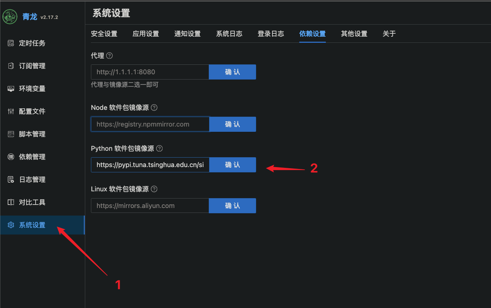
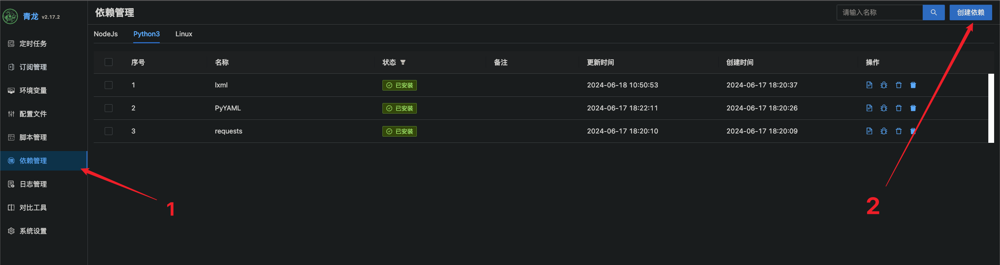
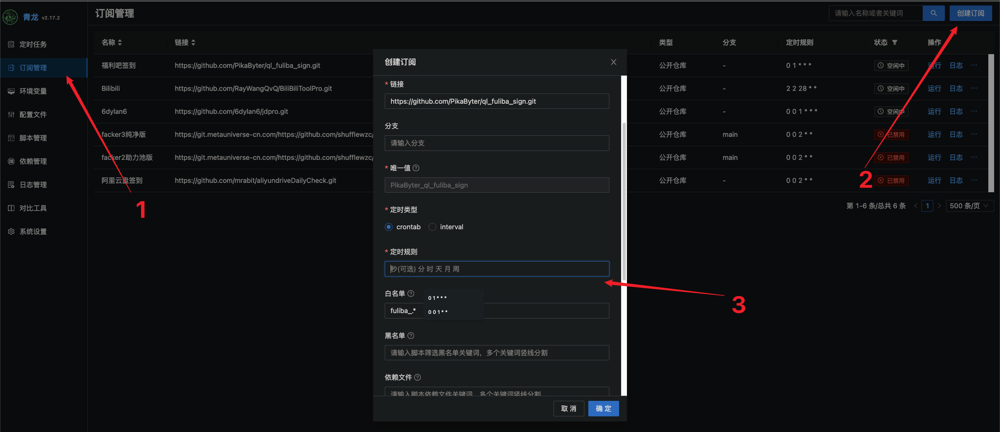
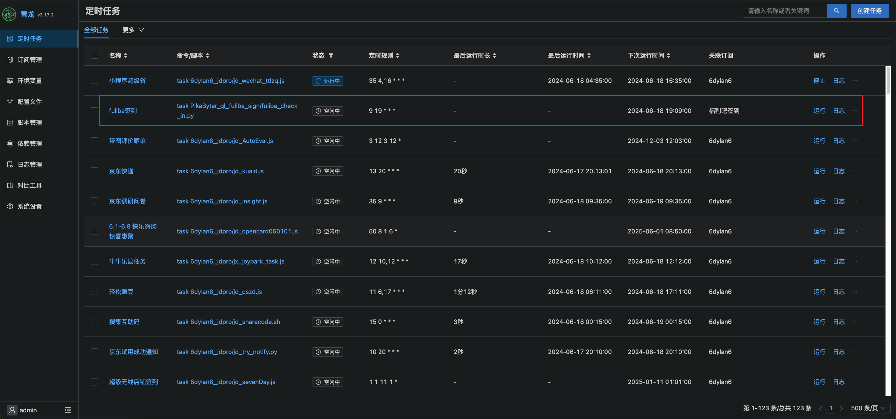

# 福利吧签到脚本

## 运行方式

### 青龙
1. 安装依赖


2. 添加仓库订阅
```
ql repo https://github.com/PikaByter/ql_fuliba_sign.git "fuliba_.*" "" "" "" ""
```

输入定时规则后完成创建，并运行
3. 添加账号密码环境变量
需要在`环境变量`一栏添加`FULIBA_USERNAME`和`FULIBA_PASSWORD`,对应的值是自己的账号密码
(PS: 若需要打开推送，请添加`FULIBA_SEND_MSG`值为`true`)
4. 初次运行


### 本地运行
本地执行以下命令即可，注意`FULIBA_USERNAME`和`FULIBA_PASSWORD`需要改成自己的账号密码:
```
cd <this project>
pip install -r requirement.txt
export FULIBA_USERNAME="xxxxxx"
export FULIBA_PASSWORD="xxxxxx"
python3 main.py
```

## 鸣谢
本仓库fork自 https://github.com/kangkang623/fuliba_sign
感谢大佬提供第一版代码


